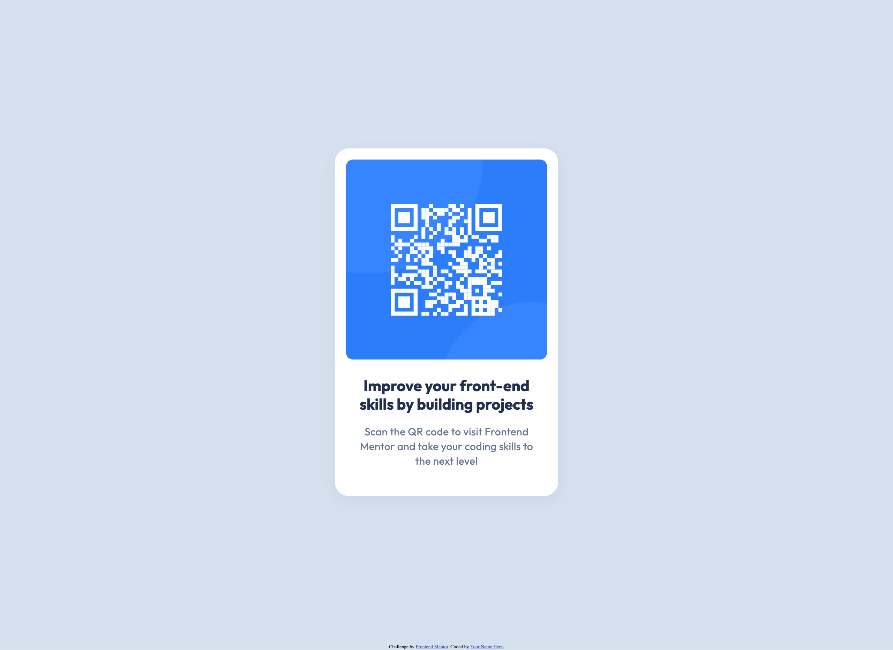
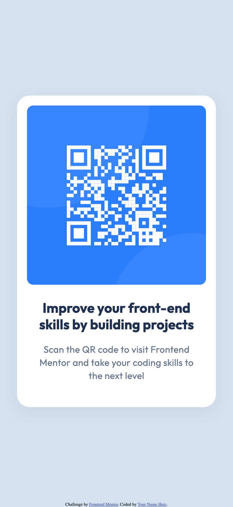

# Frontend Mentor - QR code component solution

This is a solution to the [QR code component challenge on Frontend Mentor](https://www.frontendmentor.io/challenges/qr-code-component-iux_sIO_H). Frontend Mentor challenges help you improve your coding skills by building realistic projects. 

## Table of contents

- [Overview](#overview)
  - [Screenshot](#screenshot)
  - [Links](#links)
- [My process](#my-process)
  - [Built with](#built-with)
  - [What I learned](#what-i-learned)
  - [Continued development](#continued-development)
  - [Useful resources](#useful-resources)
  - [AI Collaboration](#ai-collaboration)
- [Author](#author)
- [Acknowledgments](#acknowledgments)

**Note: Delete this note and update the table of contents based on what sections you keep.**

## Overview

### Screenshot





### Links

- Solution URL: [Add solution URL here](https://your-solution-url.com)
- Live Site URL: [Add live site URL here](https://your-live-site-url.com)

## My process

### Built with

- Semantic HTML5 markup
- CSS custom properties
- Flexbox


### What I learned

I used the BEM (Block--Element-modifier) methodology to name the different element's css classes. This methodology helps to keep a structured stylesheet and a semantic HTML5 markup. 
The sizes are set in rem (Root Em), this is, taking as a reference the size of the font at the root level. Doing this allows to resize the content keeping all the size ratios just by changing a value, the font size at the root level. 
The use of variables is a good practice as it removes the possibility to do spelling errors and have different values in a page. 
I used shorthand css properties to keep the css classes short.

I used article as it is a independent widget that can be used elsewhere
```html
<article> 
  <figure ></figure>
  <section></section>
</article>
```
```css
/* reset of standard css rules */
* {
	margin: 0;
	padding: 0;
	box-sizing: border-box;
}

/* set of variables */
:root {
	font-size: 10px;
	--black: #000;
	--shadow: rgb(0, 0, 0, 5%);
	--slate-900: #1f314f;
	--slate-500: #68778d;
	--slate-300: #d5e1ef;
	--blue-600: #2c7dfa;
	--blue-500: #3685ff;
	--white: hsl(0, 0%, 100%);
}

/* example of shorthand css properties */
.card--title {
	font: 700 2.2rem/120% "Outfit", Courier, monospace;
}
```

